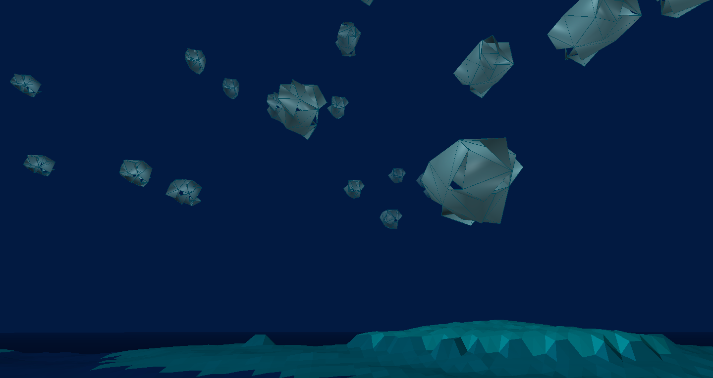

## Abstract

For my final project of TBAG, I created a morning scene. As an audio piece, I recorded sample files from the sounds, that a bowl of granola in the morning created and composed a Musique Concrète Piece out of it. For the graphics part, I extruded vertices of a triangle-subdivided cube and morphed between different extrusions to create the feeling of clouds. That, I did in Three.js

## audio project: a weird muesli morning

My idea was to create a morning feeling with the piece, using only sounds recorded while making cereal. It starts with a quiet, strange sound. More and more sounds emerge and it becomes a bit more abstract. The sounds build-up for a while until the noises stop and all you hear is the loud scraping of the spoon. From then on, a second, more rhythmic part kicks in. This is supposed to be the more active part of the morning, where you get into your routine and just act. From time to time the rhythm is interrupted by something slightly unexpected - like a real morning. Towards the end, the rhythm is interrupted more and more and turns into a strange, broken sound. In the end, all you hear is a slamming and the sad sound of a scraping spoon. This is the moment when you close the door and start the day.

For my piece of music concrète, I recorded sounds made while eating cereal in the morning. I didn't use any food sounds. Instead, I tried to capture all the other sounds that might not be so obvious. These included throwing cereal into a bowl, shaking it in the box, using different types and different textures of cereal, including muesli and oats. I recorded a 'clink' sound that a cereal made when it touched the ceramic bowl. I also recorded the opening of a milk bottle, the scratching of the surface of the bowl with a spoon, the pouring of milk around the cereal, the closing of the fridge and a voice that occurred randomly during the recording (the "aaahhh" sound).

I cut these samples into small pieces and selected the most appropriate ones. I removed the noise that was in the background with EQ subtraction. I also pitched some sounds and added reverb to the sound. For the drum part, I pitched the sounds and cut them to have the appropriate diamond shape. From the ping sound, I created a virtual MIDI controller and played some semi-harmonic keys. I experimented with putting the sounds together in different ways to create this abstract and rhythmic story. I also added automation to most of the samples and mixed the channels so that a spatial sound developed. All in all, the process was challenging for me as I had no previous experience of producing such a song and it was difficult to get the samples where I wanted them.

## graphics project: origami clouds

For the graphics project, I started by subdividing the triangles of the cube and extruding the new vertices in Three.js. Looking at these new shapes, I felt like I was looking into clouds - origami clouds. Building on that, I continued to develop the clouds. Now the clouds morph into new shapes, just like real clouds do.

The basic shape is a cube. The triangles from this cube are then subdivided, saved as new vertices and faces, and extruded. This process is done multiple times, and each new shape is stored as a morph target for the origami clouds. In the loop, the clouds then morph between the different target shapes depending on a counter that grows with each frame.  The shapes are never fully reached; the vertices only go "halfway" toward a target. One shape of this is the cube, so you see the clouds approaching a cube from time to time. 

To enhance the feeling of clouds further, I followed a tutorial to create a low poly terrain. The Low Poly shape of the terrain supports the abstract clouds, that don’t look like real clouds but behave like ones. They change their shape, you can see through them from time to time and they remind you of something else. To further enhance this and be creative, it is possible to change the colour of the clouds. As a colour scheme, I chose a blue palette to create a moody atmosphere. It looks like the end of the night - it is still dark outside, but you can already see some colours and shapes, just before the sun starts rising. After looking into those origami clouds, the morning starts. A weird morning... 

## Lessons learned

Especially the audio project was challenging to me since I had only a limited experience with audio production before. It was also a learning process to explore how I can work with my own recordings and how to capture the sounds in a good way. The piece is very experimental and as was the process. 

I had more experience with graphics, but three.js was new to me. I learned how to work with vertices, faces and normals in the Geometry and the BufferGeometry class. 

In the end, I am happy with the result and have some ideas how I could further evolve the graphics project (moving the clouds, adding sound, moving the terrain, making a gradient sky,… ), that I could work on given more time.
